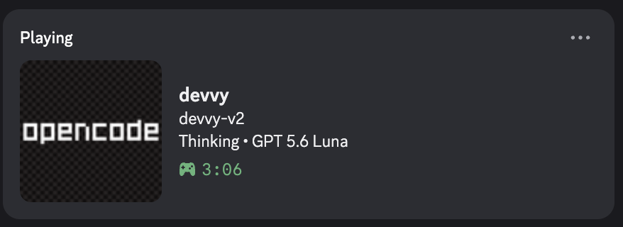

# Devvy

Devvy gives your coding workflow one clean, privacy-conscious Discord Rich
Presence. It shows what kind of work is happening without showing the work
itself.

## Install

Run this in **Terminal on macOS**:

```bash
curl -fsSL https://raw.githubusercontent.com/sonawaneutkarsh/devvy/main/install.sh | bash
```

That is the only setup command. Devvy installs its own isolated runtime and
handles the rest automatically:

- The background service starts at login.
- The VS Code extension installs automatically, even without a `code` command
  in your PATH.
- OpenCode and Command Code integrations are installed when those apps are
  available.
- Discord presence starts updating through the local daemon.

1. Paste the command into Terminal.
2. Wait for the installation to finish.
3. Reload or restart VS Code.
4. Open VS Code, OpenCode, or Command Code and start working.
5. Devvy appears on Discord.

You do not need to install Node.js, npm, Homebrew, Python, npx, a VSIX, a
LaunchAgent, or Discord RPC separately. Discord must simply be running.

## What It Looks Like



This is a real V4.0.1 Discord presence: the project, high-level state, and
detected model are visible without exposing the task itself.

## Why Devvy?

Devvy makes your presence useful at a glance. Friends can see that you are
thinking, editing, planning, reviewing, or waiting, along with the project you
are in and the AI model when it is reliably known.

It does not turn your Discord status into a transcript of your work.

## Supported Apps

- **VS Code** shows the workspace and high-level editor state.
- **OpenCode** shows the project, high-level agent state, and detected model.
- **Command Code** shows the project, high-level run state, and detected model.

## What Devvy Shows

Depending on the app and available information, Discord can show:

- Project name, using the workspace basename only
- High-level state such as **Thinking**, **Editing**, **Planning**, **Running**,
  **Reviewing**, **Searching**, **Waiting**, or **Idle**
- AI model name when the integration can reliably identify it
- A small amount of safe editor context, such as language

The display stays concise. A typical presence looks like:

```text
Devvy
Thinking • GPT 5.6
```

The exact layout depends on the active app and available model information.

## Privacy

Devvy intentionally shows only high-level context:

- Project name
- Current mode or activity
- AI model when available

Devvy intentionally does **not** show:

- Prompts or AI responses
- Source code or file contents
- Task descriptions or arbitrary commands
- Private filesystem paths
- Credentials, tokens, or secrets

Everything stays on your Mac. VS Code, OpenCode, and Command Code send small
structured updates to the local Devvy daemon at `127.0.0.1:17377`. The daemon
is the only component that communicates with Discord.

## After Installation

Usually, nothing else is required. Reload VS Code after installation so the
extension starts, then use one of the supported coding apps. Devvy starts and
restarts itself in the background.

If VS Code is installed, Devvy looks for its bundled CLI directly inside the
application, so you do not need to enable the `code` command in PATH. If the
VS Code application is incomplete and its bundled CLI cannot be found, the
installer stops with a clear error instead of claiming the extension was
installed.

## Uninstall

```bash
~/.local/share/devvy/uninstall.sh
```

This removes Devvy's daemon, isolated runtime, logs, LaunchAgent, integrations,
and Devvy VS Code extension. It does not remove unrelated LaunchAgents or
extensions.

## For Developers

The daemon owns Discord IPC. Integrations only publish safe structured state to
the loopback HTTP endpoint, and the daemon arbitrates OpenCode, Command Code,
and VS Code before creating one Discord activity.

The local test suite can be run with the bundled runtime after installation:

```bash
for test in daemon/test-*.mjs; do ~/.local/share/devvy/runtime/node "$test"; done
for test in daemon/test-*.sh; do "$test"; done
```

## License

MIT
